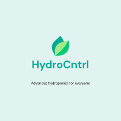

# HydroCntrl 
Scalable and opensource hydroponics automation and monitoring platform.
**HydroCntrl** uses Raspberry pi as an central server so users can plug in IOT nodes for different tasks.
**HydroCntrl** also provides a web based UI, so users can configure and monitor their systems.
Our mission is to make advanced hydroponics accessible for everyone.

## Design
HydroCntrl is composed of three main compoments:
- Client 
- Server 
- Hardware

## Capabilities
In practise IOT nodes can do whatever, but from UI they can be configured to do following things.
### Automation
- Read unlimited number of ph, ec and oxygen sensors.
- Control unlimited number of pumps, fans and solenoids.
- Make relations between sensors and devices.
### Monitoring
- Log, view and output data. 
- Stream video from multiple sources.

