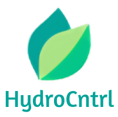

<strong>Scalable hydroponics automation platform for everyone.</strong>

## Pitch
### Problem

Let $G$ be the genetic potential of a strain.

$E_n(t)$ be a function that describes error of a cultivation variable $n$ at time $t$ compared to absolute optimal.

Finally let $R$ be the result of the cultivation cycle.

Then I'm going to state that $R = G - \sum (\int E_n(t) dt)$.

So the goal of HydroCtrl is to make $R = G$ by minimizing $E_n$ for each n.

### Solution
<strong>Master server and slave iot-node architecture.</strong>
For each parameter there is a slave node that monitors and controls the parameter according to master.
User can spesify target values and relations for parameters, such as temperature, humidity, ph and ec.
Then the user-input is sent to master and master starts informing and monitoring slaves.
Slaves use basic control algorithms to achieve results that master wants.
Master dont care how these results are achieved.

## Design
HydroCtrl is composed of three main compoments:
- Client 
- Server 
- Iot-nodes

## Capabilities
In practise IOT nodes can do whatever, but from UI they can be configured to do following things.
### Nodes
- Read unlimited number of ph, ec and oxygen sensors.
- Control unlimited number of pumps, fans and solenoids.
### Server

### UI
- Dashboard
- Rule builder/automation editor

